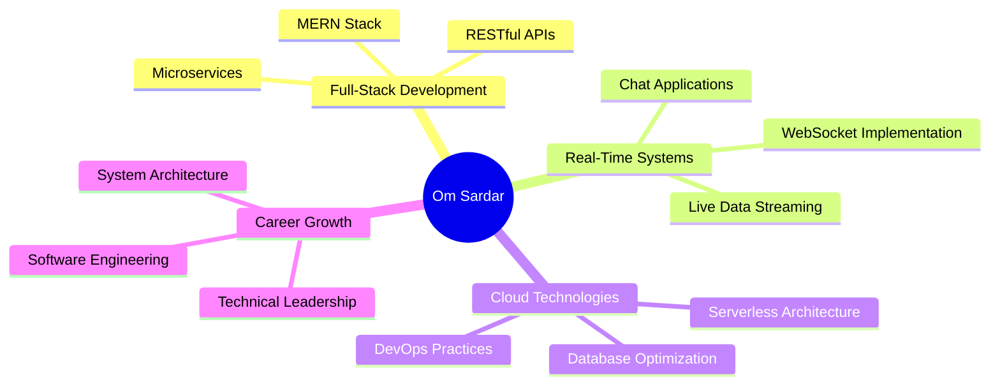

<div align="center">

# 🚀 Om Sardar
### Full-Stack Developer | MERN Specialist | Real-Time Systems Architect

[](https://yourportfolio.com)
[](https://linkedin.com/in/yourprofile)
[](mailto:youremail@gmail.com)
[](https://github.com/OM-SARDAR)

</div>

---

## 💫 Professional Summary

> **BCA Final Year Student** specializing in full-stack development with expertise in building scalable, real-time applications. Passionate about creating efficient solutions that drive business value through innovative technology implementations.

```javascript
const omSardar = {
    education: "Bachelor of Computer Applications (Final Year)",
    specialization: "MERN Stack Development",
    focus: ["Real-time Applications", "System Architecture", "API Design"],
    currentStatus: "Open to Internships & Full-time Opportunities",
    location: "India"
};
```

---

## 🛠️ Technical Arsenal

<div align="center">

### **Frontend Technologies**


### **Backend & Database**


### **Cloud & DevOps**


</div>

---

## 🚀 Featured Projects

<div align="center">

### 🏆 **Auction-X** | *Real-Time Bidding Platform*
[](https://github.com/OM-SARDAR/AUCTION-X-LOCALHOST)
[](https://github.com/OM-SARDAR/AUCTION-X-LOCALHOST)

**Enterprise-grade auction platform** featuring real-time bidding, secure payment processing, and dynamic user interfaces.

**Key Features:**
- 🔴 **Live Bidding System** with Socket.IO integration
- 💰 **Digital Wallet Management** with coin-based transactions
- 🔐 **JWT Authentication** & role-based access control
- ☁️ **Cloud Storage** integration via Cloudinary
- 📱 **Responsive Design** for cross-platform compatibility

**Tech Stack:** `MERN` • `Socket.IO` • `JWT` • `Cloudinary` • `Bootstrap`

---

### 🌟 **[Project Name]** | *Brief Description*
[](https://yourproject.com)
[](https://github.com/yourproject)

Brief compelling description highlighting the business value and technical innovation.

**Tech Stack:** `React` • `Node.js` • `MongoDB` • `Express`

---

### 🎯 **[Project Name]** | *Brief Description*
[](https://github.com/yourproject)

Brief compelling description highlighting the business value and technical innovation.

**Tech Stack:** `JavaScript` • `API Integration` • `Responsive Design`

</div>

---

## 🏆 Professional Achievements

<div align="center">

| Achievement | Details | Year |
|-------------|---------|------|
| 🏅 **Smart India Hackathon** | National Finalist | 2024 |
| ☁️ **Cloud Engineering Certification** | Bootcamp Graduate | 2024 |
| 🍃 **MongoDB Backend Development** | Codecademy Certified | 2024 |
| 🎓 **Academic Excellence** | Consistent Top Performer | 2022-2025 |

</div>

---

## 📊 GitHub Analytics

<div align="center">


</div>

---

## 💼 Professional Interests

<div align="center">



</div>

---

## 🤝 Let's Connect & Collaborate

<div align="center">

### Ready to bring innovative ideas to life through code!

**Open to:** Full-Stack Developer Roles • Internships • Freelance Projects • Technical Collaborations

[](https://yourportfolio.com)
[](https://linkedin.com/in/yourprofile)
[](mailto:youremail@gmail.com)

---

**⚡ "Turning complex problems into elegant solutions, one line of code at a time."**


</div>
