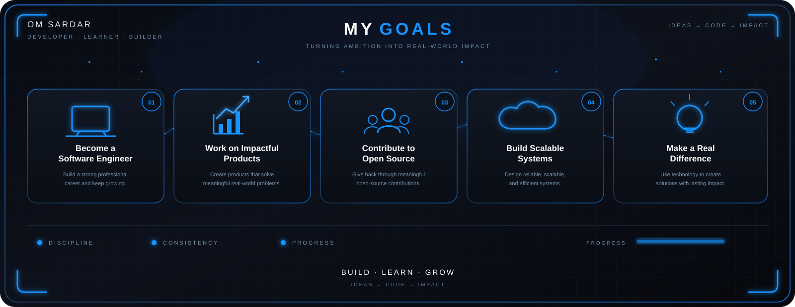
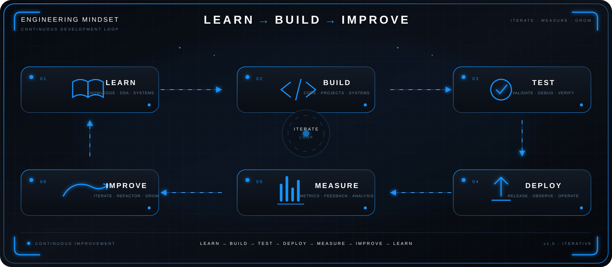

<!-- ══════════════════════════════════════════════════════════════════════════ -->
<!--                              OM SARDAR                                   -->
<!--                      GitHub Profile README                               -->
<!-- ══════════════════════════════════════════════════════════════════════════ -->

<div align="center">

  

  <h1 align="center" style="font-family: Georgia, serif;">Om Sardar</h1>

  <a href="https://git.io/typing-svg">
    
  </a>

  <br/>

  <samp>Building scalable applications and turning complex problems into elegant solutions</samp>

  <br/><br/>

  <a href="https://www.linkedin.com/in/om-sardar/">
    
  </a>&nbsp;
  <a href="mailto:omsardar14@gmail.com">
    
  </a>&nbsp;
  <a href="https://github.com/OM-SARDAR">
    
  </a>&nbsp;
  <!-- Portfolio URL is a placeholder — replace with your actual portfolio URL -->
  <a href="https://yourportfolio.com">
    
  </a>

  <br/><br/>

  
  &nbsp;
  

</div>

<!-- ══════════════════════════════════════════════════════════════════════════ -->
<!--                            NAVIGATION                                    -->
<!-- ══════════════════════════════════════════════════════════════════════════ -->

<div align="center">
  <br/>
  <a href="#about">About</a>&nbsp;&nbsp;&#8226;&nbsp;&nbsp;
  <a href="#technology-stack">Tech Stack</a>&nbsp;&nbsp;&#8226;&nbsp;&nbsp;
  <a href="#api--integrations">APIs</a>&nbsp;&nbsp;&#8226;&nbsp;&nbsp;
  <a href="#featured-projects">Projects</a>&nbsp;&nbsp;&#8226;&nbsp;&nbsp;
  <a href="#github-analytics">Analytics</a>&nbsp;&nbsp;&#8226;&nbsp;&nbsp;
  <a href="#engineering-mindset">Engineering</a>&nbsp;&nbsp;&#8226;&nbsp;&nbsp;
  <a href="#roadmap">Roadmap</a>&nbsp;&nbsp;&#8226;&nbsp;&nbsp;
  <a href="#connect">Connect</a>
  <br/><br/>
</div>

---

<!-- ══════════════════════════════════════════════════════════════════════════ -->
<!--                                ABOUT                                     -->
<!-- ══════════════════════════════════════════════════════════════════════════ -->

<h2 align="center" style="font-family: Georgia, serif;" id="about">About</h2>

<div align="center">

  

</div>

<br/>

<table width="100%">
<tr>

<td width="50%" valign="top">

<h3>About Me</h3>

Full-stack developer specializing in building scalable web applications
with the MERN stack. Passionate about backend development, system design,
cloud technologies, and AI.


▸ <strong>Education:</strong> MCA — Kalyani Government Engineering College (KGEC), West Bengal

▸ <strong>Location:</strong> Kolkata, West Bengal, India

▸ <strong>Interests:</strong> Backend Development, Distributed Systems, Cloud, AI/ML, Data Engineering

▸ <strong>Hobbies:</strong> Coffee, Painting, Blender, Exploring Tech

</td>

<td width="50%" valign="top">

<h3>Current Focus</h3>

▸ Strengthening DSA and System Design fundamentals

▸ Building real-world projects with Java and Spring Boot

▸ Exploring Cloud, AWS, DevOps and AI tools

▸ Learning Cyber Security and CI/CD pipelines

▸ Deepening Advanced AI/ML Integration

</td>

</tr>
</table>

<br/>

<div align="center">

  

</div>

<br/>

<div align="center">

  

</div>

<br/>

---

<!-- ══════════════════════════════════════════════════════════════════════════ -->
<!--                         TECHNOLOGY STACK                                 -->
<!-- ══════════════════════════════════════════════════════════════════════════ -->

<h2 align="center" style="font-family: Georgia, serif;" id="technology-stack">============: Technology Stack :============</h2>

<h3 align="center" style="font-family: Georgia, serif;">==========:Core Technologies :==========</h3>

<br/>

<div align="center">

**Programming Languages**


<br/>

**Frontend Development**


<br/>

**Backend & Databases**


<br/>

**Java Ecosystem**


<br/>

**Cloud & DevOps**


<br/>

**Developer Tools**


</div>

<br/>

<h2 align="center" style="font-family: Georgia, serif;" id="api--integrations">Libraries & Frameworks</h2>

<table width="100%">
<tr>

<td width="33%" valign="top">

<h4 align="center" style="font-family: Georgia, serif;">Frontend & UI</h4>


<br/>

<h4 align="center" style="font-family: Georgia, serif;">Backend & Middleware</h4>


</td>

<td width="33%" valign="top">

<h4 align="center" style="font-family: Georgia, serif;">Animation & Visualization</h4>


<br/>

<h4 align="center" style="font-family: Georgia, serif;">Icons & UX</h4>


<br/>

<h4 align="center" style="font-family: Georgia, serif;">Date & PDF</h4>


</td>

<td width="33%" valign="top">

<h4 align="center" style="font-family: Georgia, serif;">Databases</h4>


<br/>

<h4 align="center" style="font-family: Georgia, serif;">Mobile Development</h4>


<br/>

<h4 align="center" style="font-family: Georgia, serif;">Build & Quality</h4>


<br/>

<h4 align="center" style="font-family: Georgia, serif;">Development Environment</h4>


</td>

</tr>
</table>

---

<!-- ══════════════════════════════════════════════════════════════════════════ -->
<!--                           FEATURED PROJECTS                              -->
<!-- ══════════════════════════════════════════════════════════════════════════ -->

<h2 align="center" style="font-family: Georgia, serif;" id="featured-projects">Featured Projects</h2>

<table width="100%">
<tr>

<td colspan="3" valign="top">

<h2 align="center" style="font-family: Georgia, serif;">01 · Auction-X</h2>

<strong>Real-Time Bidding Platform</strong>

Full-featured auction platform built around real-time bidding, digital wallets,
secure authentication, and cloud-based media storage.

<strong>Core</strong><br/>

Real-time bidding · Digital wallet · JWT authentication · Cloudinary


<br/>
<a href="https://github.com/OM-SARDAR/AUCTION-X-LOCALHOST">

<strong>VIEW SOURCE ↗</strong>
</a>

</td>

</tr>

<tr>

<td width="33%" valign="top">

<h3 align="center" style="font-family: Georgia, serif;">02 · Auction-X Enhanced</h3>

<strong>AI-Integrated Auction Platform</strong>

Real-time auction system enhanced with AI functionality and modern UI/UX.


<br/>
<a href="https://github.com/OM-SARDAR/AUCTION-X-Enhanced-LOCALHOST">
<strong>VIEW SOURCE ↗</strong>
</a>

</td>

<td width="33%" valign="top">

<h3 align="center" style="font-family: Georgia, serif;">03 · Eventra</h3>

<strong>Smart Event Ticketing</strong>

Event platform for online/offline ticket issuing, validation, and QR scanning.


<br/>
<a href="https://github.com/OM-SARDAR/EVENTRA-LOCALHOST">
<strong>VIEW SOURCE ↗</strong>
</a>

</td>

<td width="33%" valign="top">

<h3 align="center" style="font-family: Georgia, serif;">04 · Lucy Chat</h3>

<strong>Real-Time AI Chat Platform</strong>

Real-time communication platform with AI chat, image sharing, authentication, and cloud storage.


<br/>
<a href="https://github.com/OM-SARDAR/LUCY-LOCALHOST">
<strong>VIEW SOURCE ↗</strong>
</a>

</td>

</tr>
</table>

---

<!-- ═══════════════════════════════════════════════════════════════════════ -->
<!--                           GITHUB ANALYTICS                              -->
<!-- ═══════════════════════════════════════════════════════════════════════ -->

<h2 align="center" style="font-family: Georgia, serif;" id="github-analytics">GitHub Analytics</h2>

<p align="center">
  <samp>Live GitHub metrics, development statistics, and contribution activity.</samp>
</p>

<br>

<!-- Profile Overview -->

<p align="center">
  
</p>

<!-- Contribution Streak -->

<p align="center">
  
</p>

<!-- Statistics -->

<p align="center">
  
</p>

<!-- Languages -->

<p align="center">
  
</p>

<br>

---

<!-- ══════════════════════════════════════════════════════════════════════════ -->
<!--                       CONTRIBUTION ACTIVITY                              -->
<!-- ══════════════════════════════════════════════════════════════════════════ -->

<h2 align="center" style="font-family: Georgia, serif;" id="contribution-activity">Contribution Activity</h2>

<p align="center">
  
</p>

<br>
---

<!-- ══════════════════════════════════════════════════════════════════════════ -->
<!--                       ENGINEERING MINDSET                                -->
<!-- ══════════════════════════════════════════════════════════════════════════ -->

<h2 align="center" style="font-family: Georgia, serif;" id="engineering-mindset">Engineering Mindset</h2>

<p align="center">
  <samp>Areas I am learning, studying, and building towards ─ not claims of production expertise.</samp>
</p>

<br/><br/>

<h3 align="center" style="font-family: Georgia, serif;">System Architecture</h3>

<div align="center">
  
</div>

<h3 align="center" style="font-family: Georgia, serif;">Key Areas of Interest</h3>

<table>
<tr>
<td width="33%" valign="top">

**Scalability & Performance**

&#9656; Horizontal scaling strategies

&#9656; Caching with Redis

&#9656; Database optimization

&#9656; Load balancing

</td>
<td width="33%" valign="top">

**Security & Reliability**

&#9656; Authentication (JWT, OAuth)

&#9656; Input validation and sanitization

&#9656; Rate limiting and CSRF protection

&#9656; Error handling patterns

</td>
<td width="33%" valign="top">

**Architecture & Design**

&#9656; API design (REST)

&#9656; Distributed systems concepts

&#9656; Event-driven patterns

&#9656; CI/CD and observability

</td>
</tr>
</table>

<br/>

<h3 align="center" style="font-family: Georgia, serif;">Engineering Learning Loop</h3>

<div align="center">
  
</div>

<br/>

<h3 align="center" style="font-family: Georgia, serif;">Development Principles</h3>

```
 01  Understand the problem before writing code
 02  Design before implementation
 03  Write maintainable, readable code
 04  Validate edge cases and failures
 05  Secure the application at every layer
 06  Test important paths thoroughly
 07  Measure before optimizing
 08  Document decisions and trade-offs
 09  Automate repetitive work
 10  Keep learning — always
```

---

<!-- ══════════════════════════════════════════════════════════════════════════ -->
<!--                             ROADMAP                                      -->
<!-- ══════════════════════════════════════════════════════════════════════════ -->

<h2 align="center" style="font-family: Georgia, serif;" id="roadmap">Roadmap</h2>

| Foundation | Current Focus | Exploring | Next |
|:-----------|:-------------|:----------|:-----|
| Full-Stack Development (MERN) | Java and Spring Boot | Microservices Architecture | Production-Scale Systems |
| REST API Design | Advanced DSA | Distributed Systems | Event-Driven Architecture |
| Authentication (JWT, OAuth) | System Design Fundamentals | Kafka and Message Queues | Agentic AI |
| Git and GitHub | AWS and Cloud Services | Redis (Advanced Patterns) | Open Source Contributions |
| MongoDB and SQL Databases | Docker and Containerization | AI/ML and LLM Applications | Advanced Backend Engineering |
| DSA Fundamentals | CI/CD Pipelines | Cloud Architecture | Data Engineering |
| Responsive Web Design | Cyber Security Concepts | Data Engineering Pipelines | System Reliability |

<br/>

<p align="center">
  <samp>Foundation = Built with &nbsp;&#8226;&nbsp; Current = Actively learning &nbsp;&#8226;&nbsp; Exploring = Starting to explore &nbsp;&#8226;&nbsp; Next = Future goals</samp>
</p>

---

<!-- ══════════════════════════════════════════════════════════════════════════ -->
<!--                       REPOSITORY STRUCTURE                               -->
<!-- ══════════════════════════════════════════════════════════════════════════ -->

<h2 align="center" style="font-family: Georgia, serif;" id="repository-structure">Repository Structure</h2>

<p align="center">
  <samp>Example project structure — represents a general approach, not a specific repository.</samp>
</p>

```
project/
├── src/
│   ├── controllers/       # Request handlers
│   ├── services/          # Business logic
│   ├── routes/            # API route definitions
│   ├── models/            # Database schemas
│   ├── middleware/         # Auth, validation, error handling
│   ├── utils/             # Helper functions
│   └── config/            # Configuration and environment
│
├── client/                # Frontend (React)
│   ├── src/
│   │   ├── components/
│   │   ├── pages/
│   │   ├── hooks/
│   │   ├── context/
│   │   └── utils/
│   └── public/
│
├── tests/                 # Unit and integration tests
├── docs/                  # Documentation
├── .github/
│   └── workflows/         # CI/CD pipelines
├── .env.example           # Environment variables template
├── Dockerfile             # Container configuration
├── README.md
└── LICENSE
```

---

<!-- ══════════════════════════════════════════════════════════════════════════ -->
<!--                          OPEN TO                                         -->
<!-- ══════════════════════════════════════════════════════════════════════════ -->

<h2 align="center" style="font-family: Georgia, serif;" id="open-to">Open To</h2>

<table>
<tr>
<td width="50%" valign="top">

&#9656; Internships and entry-level opportunities

&#9656; Full-time Software Engineering roles

&#9656; Full-Stack Development positions

&#9656; Backend Development roles

</td>
<td width="50%" valign="top">

&#9656; Freelance and technical projects

&#9656; Open-source collaboration

&#9656; Technical writing and knowledge sharing

&#9656; Interesting project collaborations

</td>
</tr>
</table>

---

<!-- ══════════════════════════════════════════════════════════════════════════ -->
<!--                            CONNECT                                       -->
<!-- ══════════════════════════════════════════════════════════════════════════ -->

<h2 align="center" style="font-family: Georgia, serif;" id="connect">Connect</h2>

<div align="center">

  <samp>Feel free to reach out for collaboration, opportunities, or just a conversation about technology.</samp>

  <br/><br/>

  <a href="https://www.linkedin.com/in/om-sardar/">
    
  </a>&nbsp;&nbsp;
  <a href="mailto:omsardar14@gmail.com">
    
  </a>&nbsp;&nbsp;
  <a href="https://github.com/OM-SARDAR">
    
  </a>&nbsp;&nbsp;
  <!-- Portfolio URL is a placeholder — replace with your actual portfolio URL -->
  <a href="https://yourportfolio.com">
    
  </a>

  <br/><br/>

  <samp>"Let's build, learn, and grow together."</samp>

</div>

---

<!-- ══════════════════════════════════════════════════════════════════════════ -->
<!--                             FOOTER                                       -->
<!-- ══════════════════════════════════════════════════════════════════════════ -->

<div align="center">

  <br/>

  <samp><strong>Build with purpose. Learn continuously. Ship better.</strong></samp>

  <br/><br/>

  <samp>Code &nbsp;&#8226;&nbsp; Learn &nbsp;&#8226;&nbsp; Build &nbsp;&#8226;&nbsp; Improve</samp>

</div>
