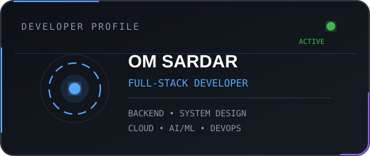
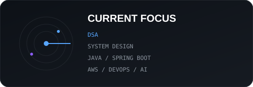

<!-- ══════════════════════════════════════════════════════════════════════════ -->
<!--                              OM SARDAR                                   -->
<!--                      GitHub Profile README                               -->
<!-- ══════════════════════════════════════════════════════════════════════════ -->


<div align="center">

<div align="center">
  
</div>

  <h1>Om Sardar</h1>

  <a href="https://git.io/typing-svg">
    
  </a>

  <br/>

  <samp>Building scalable applications and turning complex problems into elegant solutions</samp>

  <br/><br/>

  <a href="https://www.linkedin.com/in/om-sardar/">
    
  </a>&nbsp;
  <a href="mailto:omsardar14@gmail.com">
    
  </a>&nbsp;
  <a href="https://github.com/OM-SARDAR">
    
  </a>&nbsp;
  <!-- Portfolio URL is a placeholder — replace with your actual portfolio URL -->
  <a href="https://yourportfolio.com">
    
  </a>

  <br/><br/>

  
  &nbsp;
  

</div>

<!-- ══════════════════════════════════════════════════════════════════════════ -->
<!--                            NAVIGATION                                    -->
<!-- ══════════════════════════════════════════════════════════════════════════ -->

<div align="center">
  <br/>
  <a href="#about">About</a>&nbsp;&nbsp;&#8226;&nbsp;&nbsp;
  <a href="#technology-stack">Tech Stack</a>&nbsp;&nbsp;&#8226;&nbsp;&nbsp;
  <a href="#api--integrations">APIs</a>&nbsp;&nbsp;&#8226;&nbsp;&nbsp;
  <a href="#featured-projects">Projects</a>&nbsp;&nbsp;&#8226;&nbsp;&nbsp;
  <a href="#github-analytics">Analytics</a>&nbsp;&nbsp;&#8226;&nbsp;&nbsp;
  <a href="#engineering-mindset">Engineering</a>&nbsp;&nbsp;&#8226;&nbsp;&nbsp;
  <a href="#roadmap">Roadmap</a>&nbsp;&nbsp;&#8226;&nbsp;&nbsp;
  <a href="#connect">Connect</a>
  <br/><br/>
</div>

---

<!-- ══════════════════════════════════════════════════════════════════════════ -->
<!--                              ABOUT                                       -->
<!-- ══════════════════════════════════════════════════════════════════════════ -->

## About

<table>
<tr>

<td width="55%" valign="top">

<div align="center">



</div>

### About Me

Full-stack developer specializing in building scalable web
applications with the MERN stack. Passionate about backend
development, system design, cloud technologies, and AI.

<br/>

▸ **Education:** MCA — Kalyani Government Engineering College (KGEC), West Bengal

▸ **Location:** Kolkata, West Bengal, India

▸ **Interests:** Backend Development, Distributed Systems, Cloud, AI/ML, Data Engineering

▸ **Hobbies:** Coffee, Painting, Blender, Exploring Tech

</td>

<td width="45%" valign="top">

<div align="center">



</div>

### Current Focus

▸ Strengthening DSA and System Design fundamentals

▸ Building real-world projects with Java and Spring Boot

▸ Exploring Cloud, AWS, DevOps and AI tools

▸ Learning Cyber Security and CI/CD pipelines

▸ Deepening Advanced AI/ML Integration

### Goals

▸ Become a professional Software Engineer

▸ Work on impactful, scalable products

▸ Contribute to meaningful open-source projects

▸ Build systems that make a real difference

</td>

</tr>
</table>

---

<!-- ══════════════════════════════════════════════════════════════════════════ -->
<!--                         TECHNOLOGY STACK                                 -->
<!-- ══════════════════════════════════════════════════════════════════════════ -->

## Technology Stack

### Core Technologies

<div align="center">

**Programming Languages**


<br/><br/>

**Frontend Development**


<br/><br/>

**Backend & Databases**


<br/><br/>

**Java Ecosystem**


<br/><br/>

**Cloud & DevOps**


<br/><br/>

**Developer Tools**


</div>

<br/>

### Libraries & Frameworks

#### Frontend Libraries & UI


#### Animation & Visualization


#### Icons & UI Libraries


#### Backend Middleware & Utilities


#### Date, PDF & Utilities


#### Additional Databases


#### Mobile Development


#### Build & Quality Tools


#### Additional IDEs


---

<!-- ══════════════════════════════════════════════════════════════════════════ -->
<!--                        API & INTEGRATIONS                                -->
<!-- ══════════════════════════════════════════════════════════════════════════ -->

## API & Integrations

<table>
<tr>
<td width="50%" valign="top">

<h4>Authentication & Security</h4>

<p>


</p>

<br/>

<h4>Real-Time Communication</h4>

<p>


</p>

</td>
<td width="50%" valign="top">

<h4>Cloud Storage & Media</h4>

<p>


</p>

<br/>

<h4>AI & Machine Learning</h4>

<p>


</p>

<br/>

<h4>Email & Notifications</h4>

<p>


</p>

</td>
</tr>
</table>

---

<!-- ══════════════════════════════════════════════════════════════════════════ -->
<!--                        FEATURED PROJECTS                                 -->
<!-- ══════════════════════════════════════════════════════════════════════════ -->

## Featured Projects

<table>
<tr>
<td width="50%" valign="top">

<h3>Auction-X</h3>

<strong>Real-Time Bidding Platform</strong>

<br/><br/>

A full-featured auction platform with real-time bidding capabilities, digital wallet system, and secure authentication.

<br/><br/>

<strong>Key Features</strong>

<ul>
<li>Real-time bidding with Socket.IO</li>
<li>Digital wallet and coin-based transactions</li>
<li>JWT authentication and authorization</li>
<li>Cloudinary integration for media storage</li>
<li>Fully responsive design</li>
</ul>

<strong>Tech Stack</strong>

<br/><br/>


<br/><br/>

<a href="https://github.com/OM-SARDAR/AUCTION-X-LOCALHOST">

</a>

</td>
<td width="50%" valign="top">

<h3>Auction-X Enhanced</h3>

<strong>AI-Integrated Real-Time Auction Platform</strong>

<br/><br/>

An enhanced auction platform with AI integration, real-time bidding, digital wallet system, and modern UI/UX.

<br/><br/>

<strong>Key Features</strong>

<ul>
<li>Real-time bidding with Socket.IO</li>
<li>Digital wallet and coin-based transactions</li>
<li>JWT authentication and authorization</li>
<li>Cloudinary integration for media storage</li>
<li>AI-powered features and responsive UI</li>
</ul>

<strong>Tech Stack</strong>

<br/><br/>


<br/><br/>

<a href="https://github.com/OM-SARDAR/AUCTION-X-Enhanced-LOCALHOST">

</a>

</td>
</tr>
<tr>
<td width="50%" valign="top">

<h3>Eventra</h3>

<strong>Smart Event Ticketing & Scanning System</strong>

<br/><br/>

A smart event management platform enabling organizers to issue, verify, and scan tickets both online and offline using QR code technology.

<br/><br/>

<strong>Key Features</strong>

<ul>
<li>QR-based ticket scanning (online and offline)</li>
<li>E-ticket generation and validation</li>
<li>JWT-based secure authentication</li>
<li>Offline-first capabilities</li>
<li>Fully responsive interface</li>
</ul>

<strong>Tech Stack</strong>

<br/><br/>


<br/><br/>

<a href="https://github.com/OM-SARDAR/EVENTRA-LOCALHOST">

</a>

</td>
<td width="50%" valign="top">

<h3>Lucy Chat</h3>

<strong>Real-Time Chat Platform with AI Integration</strong>

<br/><br/>

A real-time chatting platform featuring AI-powered chat functionality, image sharing, and modern UI/UX designed for performance and scalability.

<br/><br/>

<strong>Key Features</strong>

<ul>
<li>Real-time chatting with Socket.IO</li>
<li>Text and image message sharing</li>
<li>JWT authentication and authorization</li>
<li>Cloudinary integration for media storage</li>
<li>AI-powered chat buddy system</li>
</ul>

<strong>Tech Stack</strong>

<br/><br/>


<br/><br/>

<a href="https://github.com/OM-SARDAR/LUCY-LOCALHOST">

</a>

</td>
</tr>
</table>

---

<!-- ═══════════════════════════════════════════════════════════════════════ -->
<!--                         GITHUB ANALYTICS                               -->
<!-- ═══════════════════════════════════════════════════════════════════════ -->

## GitHub Analytics

<samp>Live GitHub metrics, development statistics, and contribution activity.</samp>

<br>

<div align="center">

  <!-- Profile Overview -->
  

  <br><br>

  <!-- Repository Languages -->
  

  

  <br><br>

  <!-- GitHub Statistics -->
  

  

  <br><br>

  <!-- Contribution Streak -->
  

</div>

<br>

---

---

## Activity Graph

<div align="center">

  

</div>

<br>

---

---

## Contribution Activity

<div align="center">

  

</div>

<br>

<br>
---

<!-- ══════════════════════════════════════════════════════════════════════════ -->
<!--                       ENGINEERING MINDSET                                -->
<!-- ══════════════════════════════════════════════════════════════════════════ -->

## Engineering Mindset

<samp>Areas I am learning, studying, and building towards ─ not claims of production expertise.</samp>

<br/><br/>

### System Architecture

<div align="center">

  

</div>

### Key Areas of Interest

<table>
<tr>
<td width="33%" valign="top">

**Scalability & Performance**

&#9656; Horizontal scaling strategies

&#9656; Caching with Redis

&#9656; Database optimization

&#9656; Load balancing

</td>
<td width="33%" valign="top">

**Security & Reliability**

&#9656; Authentication (JWT, OAuth)

&#9656; Input validation and sanitization

&#9656; Rate limiting and CSRF protection

&#9656; Error handling patterns

</td>
<td width="33%" valign="top">

**Architecture & Design**

&#9656; API design (REST)

&#9656; Distributed systems concepts

&#9656; Event-driven patterns

&#9656; CI/CD and observability

</td>
</tr>
</table>

<br/>

### Engineering Learning Loop

```
      ┌────────┐       ┌────────┐       ┌────────┐
      │ LEARN  │──────▶│ BUILD  │──────▶│  TEST  │
      └────────┘       └────────┘       └────────┘
           ▲                                 │
           │                                 ▼
      ┌────────┐       ┌────────┐       ┌────────┐
      │IMPROVE │◀──────│MEASURE │◀──────│ DEPLOY │
      └────────┘       └────────┘       └────────┘
```

<br/>

### Development Principles

```
 01  Understand the problem before writing code
 02  Design before implementation
 03  Write maintainable, readable code
 04  Validate edge cases and failures
 05  Secure the application at every layer
 06  Test important paths thoroughly
 07  Measure before optimizing
 08  Document decisions and trade-offs
 09  Automate repetitive work
 10  Keep learning — always
```

---

<!-- ══════════════════════════════════════════════════════════════════════════ -->
<!--                             ROADMAP                                      -->
<!-- ══════════════════════════════════════════════════════════════════════════ -->

## Roadmap

| Foundation | Current Focus | Exploring | Next |
|:-----------|:-------------|:----------|:-----|
| Full-Stack Development (MERN) | Java and Spring Boot | Microservices Architecture | Production-Scale Systems |
| REST API Design | Advanced DSA | Distributed Systems | Event-Driven Architecture |
| Authentication (JWT, OAuth) | System Design Fundamentals | Kafka and Message Queues | Agentic AI |
| Git and GitHub | AWS and Cloud Services | Redis (Advanced Patterns) | Open Source Contributions |
| MongoDB and SQL Databases | Docker and Containerization | AI/ML and LLM Applications | Advanced Backend Engineering |
| DSA Fundamentals | CI/CD Pipelines | Cloud Architecture | Data Engineering |
| Responsive Web Design | Cyber Security Concepts | Data Engineering Pipelines | System Reliability |

<br/>

<samp>Foundation = Built with &nbsp;&#8226;&nbsp; Current = Actively learning &nbsp;&#8226;&nbsp; Exploring = Starting to explore &nbsp;&#8226;&nbsp; Next = Future goals</samp>

---

<!-- ══════════════════════════════════════════════════════════════════════════ -->
<!--                       REPOSITORY STRUCTURE                               -->
<!-- ══════════════════════════════════════════════════════════════════════════ -->

## Repository Structure

<samp>Example project structure — represents a general approach, not a specific repository.</samp>

```
project/
├── src/
│   ├── controllers/       # Request handlers
│   ├── services/          # Business logic
│   ├── routes/            # API route definitions
│   ├── models/            # Database schemas
│   ├── middleware/         # Auth, validation, error handling
│   ├── utils/             # Helper functions
│   └── config/            # Configuration and environment
│
├── client/                # Frontend (React)
│   ├── src/
│   │   ├── components/
│   │   ├── pages/
│   │   ├── hooks/
│   │   ├── context/
│   │   └── utils/
│   └── public/
│
├── tests/                 # Unit and integration tests
├── docs/                  # Documentation
├── .github/
│   └── workflows/         # CI/CD pipelines
├── .env.example           # Environment variables template
├── Dockerfile             # Container configuration
├── README.md
└── LICENSE
```

---

<!-- ══════════════════════════════════════════════════════════════════════════ -->
<!--                          OPEN TO                                         -->
<!-- ══════════════════════════════════════════════════════════════════════════ -->

## Open To

<table>
<tr>
<td width="50%" valign="top">

&#9656; Internships and entry-level opportunities

&#9656; Full-time Software Engineering roles

&#9656; Full-Stack Development positions

&#9656; Backend Development roles

</td>
<td width="50%" valign="top">

&#9656; Freelance and technical projects

&#9656; Open-source collaboration

&#9656; Technical writing and knowledge sharing

&#9656; Interesting project collaborations

</td>
</tr>
</table>

---

<!-- ══════════════════════════════════════════════════════════════════════════ -->
<!--                            CONNECT                                       -->
<!-- ══════════════════════════════════════════════════════════════════════════ -->

## Connect

<div align="center">

  <samp>Feel free to reach out for collaboration, opportunities, or just a conversation about technology.</samp>

  <br/><br/>

  <a href="https://www.linkedin.com/in/om-sardar/">
    
  </a>&nbsp;&nbsp;
  <a href="mailto:omsardar14@gmail.com">
    
  </a>&nbsp;&nbsp;
  <a href="https://github.com/OM-SARDAR">
    
  </a>&nbsp;&nbsp;
  <!-- Portfolio URL is a placeholder — replace with your actual portfolio URL -->
  <a href="https://yourportfolio.com">
    
  </a>

  <br/><br/>

  <samp>"Let's build, learn, and grow together."</samp>

</div>

---

<!-- ══════════════════════════════════════════════════════════════════════════ -->
<!--                             FOOTER                                       -->
<!-- ══════════════════════════════════════════════════════════════════════════ -->

<div align="center">

  <br/>

  <samp><strong>Build with purpose. Learn continuously. Ship better.</strong></samp>

  <br/><br/>

  <samp>Code &nbsp;&#8226;&nbsp; Learn &nbsp;&#8226;&nbsp; Build &nbsp;&#8226;&nbsp; Improve</samp>

  <br/><br/>

  

</div>
